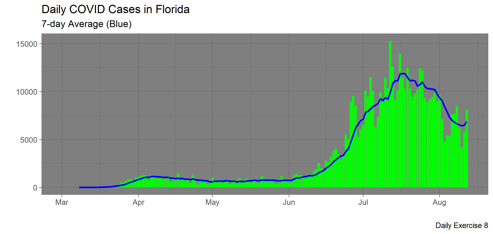
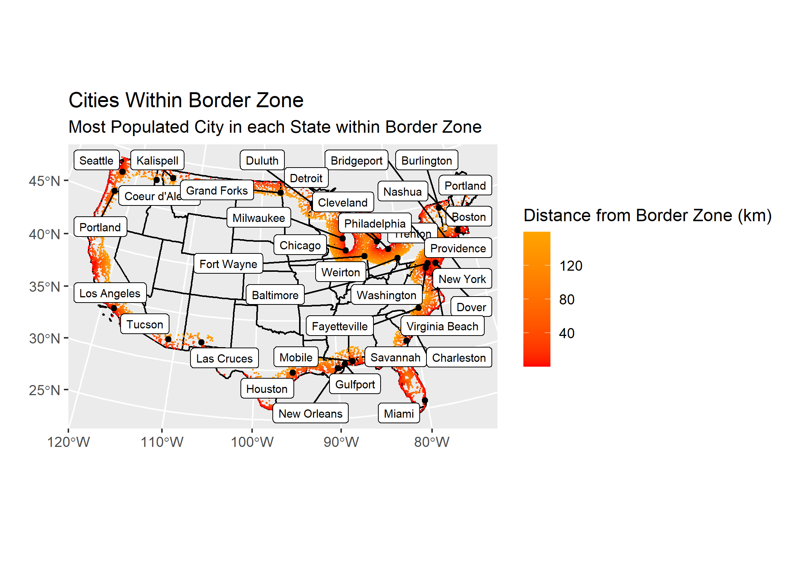
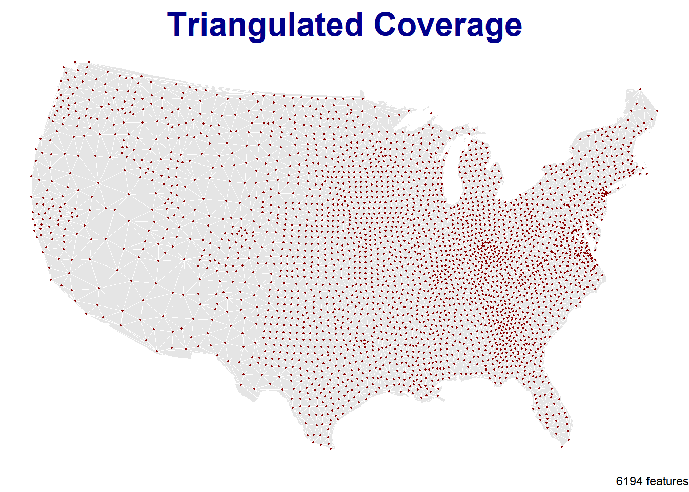
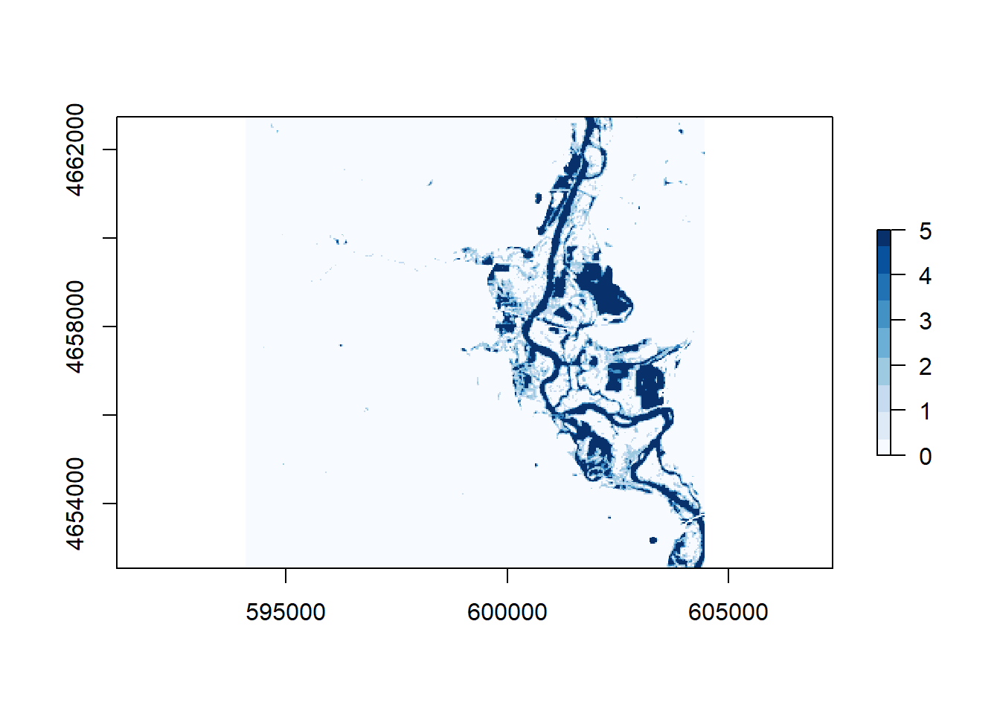
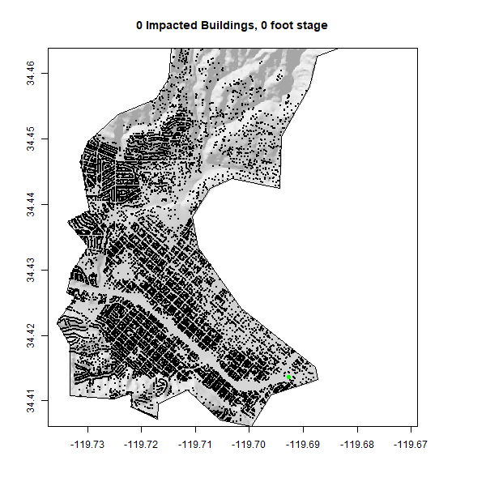

In the summer of 2020, I took a GIS course based in R. I wrote some code, and did some cool data science. Here is a collection of links!

## [Lab 1: Data Science Workflows](https://github.com/LeslieAlonzo98/LeslieAlonzo98)

- In this assignment we built a static users site with Github pages

- I learned how to apply knowledge from previous activities to create files within my project

- Familiarized myself with functions in Rstudio
- Learned how to insert a picture and icons on RMarkdown

## [Lab 2: Data Wrangling](https://LeslieAlonzo98.github.io/geog-176A-labs/docs/lab-02.html)

- In this lab we practiced data wrangling and visualization skills.

- We used COVID-19 data from the New York Times, to determine the COVID conditions at a county level

- We were introduced to new libraries such as readxl, to read in data, and zoo, to determine things like the rolling mean of any given data.

{width="50%"}

## [Lab 3: Projections, Distances, and Mapping](https://LeslieAlonzo98.github.io/geog-176A-labs/docs/lab-03.html)

- In this lab we were introduced to sf, sfc, and sfg features and objects.

- I learned how to install github libraries that would allow us to read in US boundary data.

- I learned how to further edit our gg plots to be more descriptive of the data we are representing.

{width="50%"}

## [Lab 4: Tesselations, Spatial Joins, and Point-in-Polygon](https://LeslieAlonzo98.github.io/geog-176A-labs/docs/lab-04.html)

- I learned how to write functions to expedite tasks. 

- I learned how to tesselate surfaces for our county data.

- This was one of the more challenging labs for me but helped me better understand the basis of functions.

{width="50%"}

## [Lab 5: Raster Analysis](https://LeslieAlonzo98.github.io/geog-176A-labs/docs/lab-05.html)

- I learned how to identify an AOI for out data.

- We were introduced to the getlandsat package in R, to import satellite images into our code.

- I learned how to use bands to find which combination best represents or AOI and data.

- I learned how to extract data and create tif files.

{width="50%"}

## [Lab 6: Terrain Analysis](https://LeslieAlonzo98.github.io/geog-176A-labs/docs/lab-06.html)

- I learned how to layer different types of data (raster/vector), to create descriptive maps showing live data.

- I learned how to create a gif file.

- I applied my knowledge from past labs to and effectively used them in lab 6 to create Flood Inundation Map

{width="50%"}